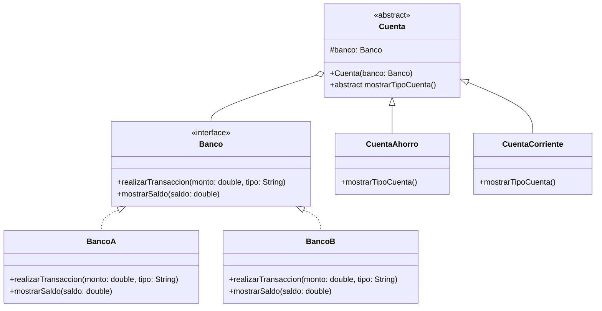
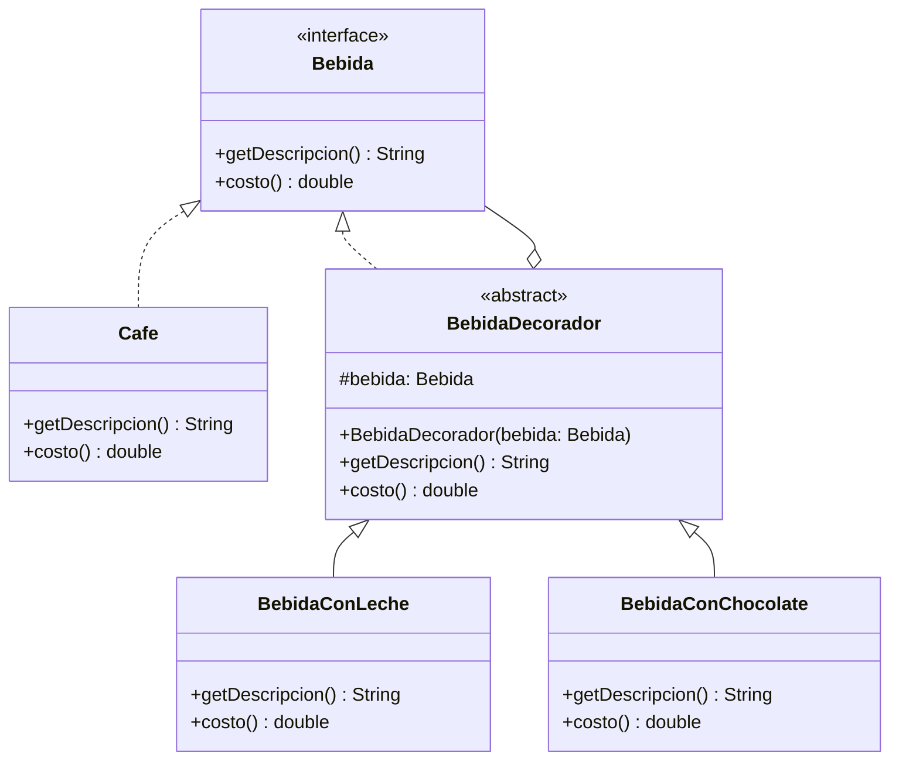

# Patrones de Diseño en Java

Este proyecto contiene implementaciones de varios patrones de diseño en Java, organizados por paquetes y utilizando Gradle como sistema de construcción.

## Estructura del Proyecto

- **builder**  
  Implementaciones del patrón Builder (con clases y records).

- **factory**  
  Ejemplos de:
  - *Abstract Factory*: Combos de restaurante.
  - *Factory Method*: Notificaciones.
  - *Simple Factory*: Formas geométricas.

- **prototype**  
  Implementaciones del patrón Prototype con robots.

- **singleton**  
  Implementaciones del patrón Singleton Robo Manager.

## Requisitos

- Java 17+
- Gradle 7+

## Cómo ejecutar

1. Clona el repositorio.
2. Compila el proyecto:

## Diagramas UML

### Patrón Bridge (Banco)

### Patrón Decorator (Bebidas)

