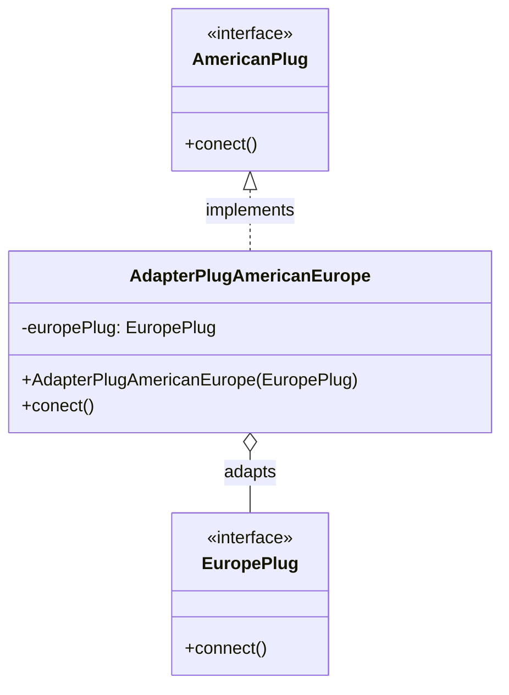

# Patrón Adapter

Este paquete contiene una implementación del patrón Adapter que permite adaptar un enchufe europeo para que funcione con una toma americana.

## Diagrama de Clases



## Descripción

El patrón Adapter se utiliza cuando necesitamos que una clase existente funcione con otra interfaz. En este ejemplo:

- `AmericanPlug`: Interfaz objetivo que define el método `conect()`
- `EuropePlug`: Interfaz existente con el método `connect()`
- `AdapterPlugAmericanEurope`: Adaptador que implementa `AmericanPlug` y utiliza `EuropePlug`

## Uso

```java
EuropePlug europePlug = new EuropePlug() {
    @Override
    public void connect() {
        // Implementación
    }
};

AmericanPlug americanPlug = new AdapterPlugAmericanEurope(europePlug);
americanPlug.conect(); // Llama internamente a europePlug.connect()
```
