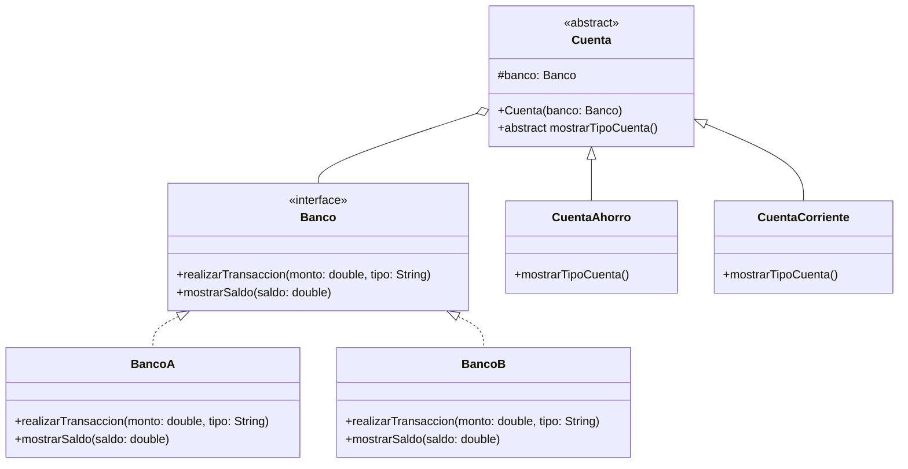

### Patrón Bridge (Banco)

```mermaid
classDiagram
    class Banco {
        <<interface>>
        +realizarTransaccion(monto: double, tipo: String)
        +mostrarSaldo(saldo: double)
    }
    class BancoA {
        +realizarTransaccion(monto: double, tipo: String)
        +mostrarSaldo(saldo: double)
    }
    class BancoB {
        +realizarTransaccion(monto: double, tipo: String)
        +mostrarSaldo(saldo: double)
    }
    class Cuenta {
        <<abstract>>
        #banco: Banco
        +Cuenta(banco: Banco)
        +abstract mostrarTipoCuenta()
    }
    class CuentaAhorro {
        +mostrarTipoCuenta()
    }
    class CuentaCorriente {
        +mostrarTipoCuenta()
    }

    Banco <|.. BancoA
    Banco <|.. BancoB
    Cuenta <|-- CuentaAhorro
    Cuenta <|-- CuentaCorriente
    Cuenta o-- Banco
```