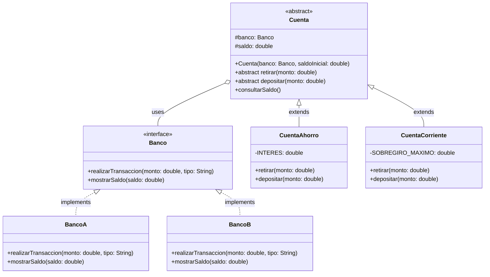

# Patrón Bridge (Puente)

El patrón Bridge es un patrón estructural que separa la abstracción de su implementación, permitiendo que ambas puedan variar independientemente. Este patrón es especialmente útil cuando necesitamos evitar un vínculo permanente entre una abstracción y su implementación.

## Propósito

- Desacoplar una abstracción de su implementación para que ambas puedan variar independientemente
- Evitar una proliferación de clases cuando una clase puede tener múltiples implementaciones
- Permitir que tanto las abstracciones como las implementaciones sean extensibles por subclases

## Estructura del Proyecto

```
bridge/
├── abstraction/
│   ├── Cuenta.java         # Abstracción base
│   ├── CuentaAhorro.java   # Abstracción refinada
│   └── CuentaCorriente.java# Abstracción refinada
├── impls/
│   ├── Banco.java         # Implementador
│   ├── BancoA.java        # Implementación concreta
│   └── BancoB.java        # Implementación concreta
└── Client.java            # Cliente que usa el patrón
```

## Diagrama de Clases



## Componentes

1. **Abstracción (Cuenta)**
   - Define la interfaz de alto nivel para las cuentas bancarias
   - Mantiene una referencia al implementador (Banco)
   - Delega las operaciones concretas al implementador

2. **Implementador (Banco)**
   - Define la interfaz para las clases de implementación
   - Proporciona operaciones primitivas que la abstracción utilizará

3. **Abstracciones Refinadas (CuentaAhorro, CuentaCorriente)**
   - Extienden la abstracción con funcionalidades específicas
   - CuentaAhorro: Maneja intereses en depósitos
   - CuentaCorriente: Permite sobregiros hasta un límite

4. **Implementaciones Concretas (BancoA, BancoB)**
   - Implementan la interfaz del implementador
   - Proporcionan las implementaciones específicas para cada banco

## Ejemplo de Uso

```java
// Crear implementaciones de bancos
Banco bancoA = new BancoA();
Banco bancoB = new BancoB();

// Crear diferentes tipos de cuentas con diferentes bancos
Cuenta ahorroEnBancoA = new CuentaAhorro(bancoA, 1000);
Cuenta corrienteEnBancoB = new CuentaCorriente(bancoB, 2000);

// Realizar operaciones
ahorroEnBancoA.depositar(500);    // Aplicará interés
corrienteEnBancoB.retirar(2500);  // Permitirá sobregiro
```

## Beneficios

1. **Desacoplamiento**
   - La implementación del banco está completamente separada de los tipos de cuenta
   - Se pueden agregar nuevos tipos de cuenta sin modificar los bancos existentes
   - Se pueden agregar nuevos bancos sin modificar las cuentas existentes

2. **Extensibilidad**
   - Nuevos tipos de cuenta pueden ser agregados fácilmente
   - Nuevos bancos pueden ser integrados sin problemas

3. **Ocultamiento de Implementación**
   - Los clientes solo ven la abstracción de alto nivel (Cuenta)
   - Los detalles de implementación del banco están ocultos

## Casos de Uso

- Cuando quieres evitar un enlace permanente entre la abstracción y su implementación
- Cuando tanto las abstracciones como las implementaciones deben ser extensibles por subclases
- Cuando los cambios en la implementación no deben afectar a los clientes
