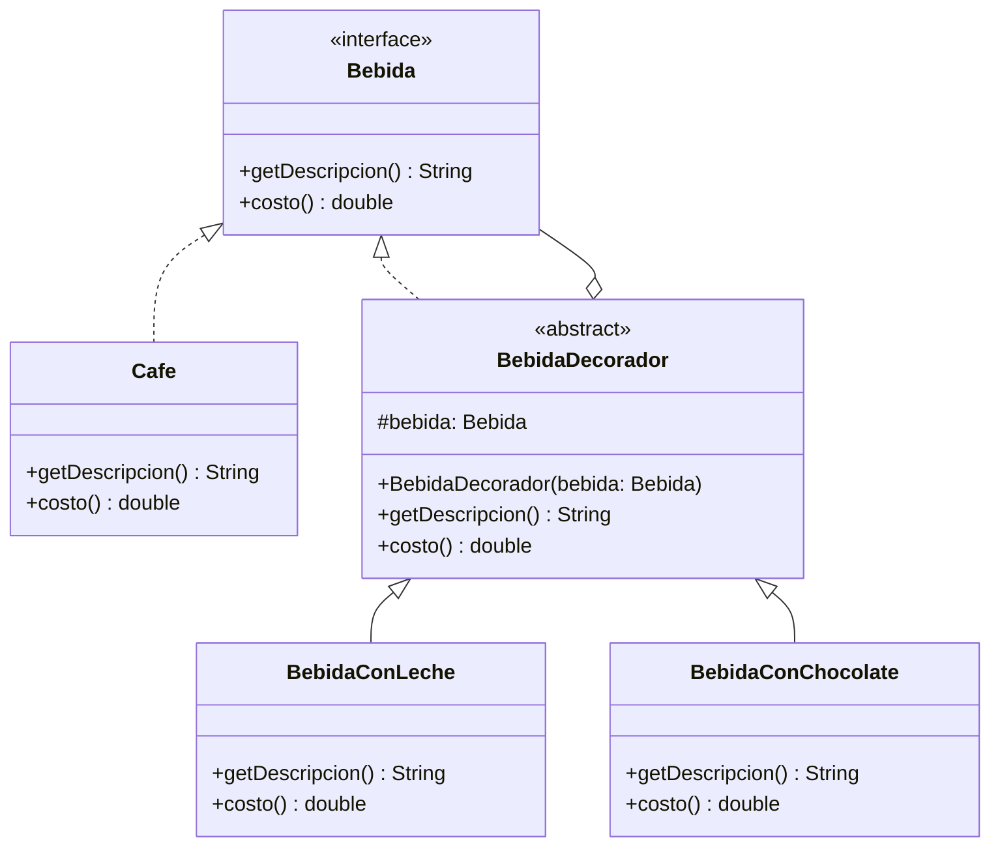

### Patrón Decorator (Bebidas)

```mermaid
classDiagram
    class Bebida {
        <<interface>>
        +getDescripcion() String
        +costo() double
    }
    class Cafe {
        +getDescripcion() String
        +costo() double
    }
    class BebidaDecorador {
        <<abstract>>
        #bebida: Bebida
        +BebidaDecorador(bebida: Bebida)
        +getDescripcion() String
        +costo() double
    }
    class BebidaConLeche {
        +getDescripcion() String
        +costo() double
    }
    class BebidaConChocolate {
        +getDescripcion() String
        +costo() double
    }

    Bebida <|.. Cafe
    Bebida <|.. BebidaDecorador
    BebidaDecorador <|-- BebidaConLeche
    BebidaDecorador <|-- BebidaConChocolate
    BebidaDecorador o-- Bebida
```
